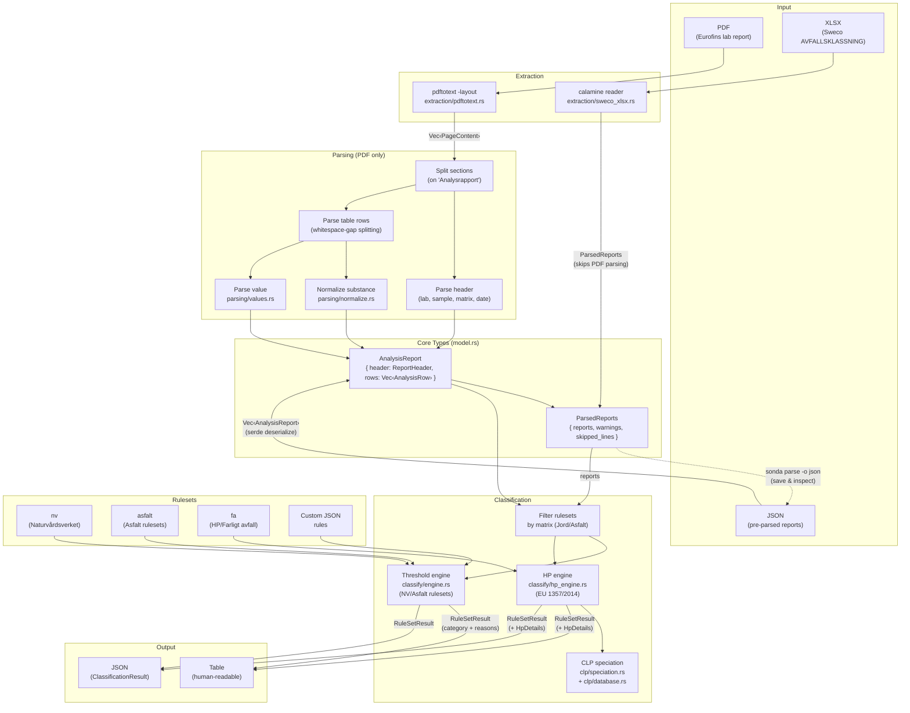

# Pipeline Architecture

> **Keep this diagram up to date.** When adding new input formats, processing
> steps, classification engines, or output formats, update the diagram below
> to reflect the change.

## Overview



## CLI Commands

| Command | Input | Pipeline | Output |
|---------|-------|----------|--------|
| `sonda parse report.pdf` | PDF | Extract → Parse | Table or JSON |
| `sonda parse sweco.xlsx` | XLSX | XLSX Parse | Table or JSON |
| `sonda classify report.pdf` | PDF | Extract → Parse → Classify | Table or JSON |
| `sonda classify sweco.xlsx` | XLSX | XLSX Parse → Classify | Table or JSON |
| `sonda classify parsed.json` | JSON | Deserialize → Classify | Table or JSON |

## Key Data Types

```
PDF bytes
  → Vec<PageContent> { lines, line_spans }        (extraction)
    → ParsedReports { reports, warnings, skipped } (parsing)
      → Vec<AnalysisReport> { header, rows }       (core model)
        → ClassificationResult { samples, trace }  (classification)
          → Vec<SampleResult> { ruleset_results }
            → RuleSetResult { category, substances, hp_details }
```
